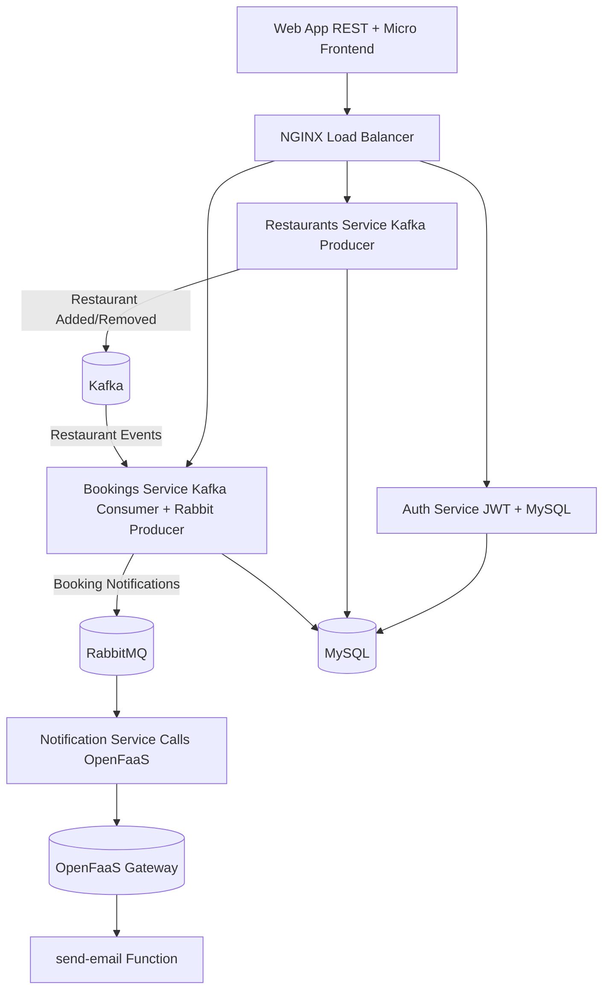

# Distributed Restaurant Booking System (Go + Microservices)

A full microservices-based restaurant booking platform built in **Go**, demonstrating service communication via **Kafka**, **RabbitMQ**, and **OpenFaaS**, with persistence in **MySQL** and traffic routed through **Nginx**.

---

## Architecture Overview



---

## External Components

| Component | Role | Notes |
|------------|------|-------|
| MySQL | Persistent store for users, restaurants, and bookings. | Initialized via `mysql/init.sql` with seed data. |
| Kafka (Confluent) | Event streaming backbone. | Restaurants service produces *restaurant added/removed* events. Bookings service consumes them. |
| RabbitMQ | Message broker for asynchronous notifications. | Bookings service publishes "booking confirmed" events, Notification service consumes them. |
| OpenFaaS | Function-as-a-Service (FaaS) platform. | Notification service triggers a `send-email` function via HTTP call. |
| NGINX | Reverse proxy and load balancer. | Routes incoming requests to respective services (`/auth`, `/restaurants`, `/bookings`). |

---

## Microservices

### 1. Auth Service
- Handles user registration and login.
- Issues JWT tokens for authentication.
- Persists users in MySQL (`users` table).
- Exposes `/auth/login` and `/auth/register`.

### 2. Restaurants Service
- CRUD operations for restaurants (`restaurants` table).
- Publishes Kafka events when a restaurant is added or removed.
- Other services (like Bookings) consume those events.

### 3. Bookings Service
- Manages restaurant bookings (`bookings` table).
- Consumes restaurant events from Kafka (to handle removals).
- Produces booking notifications to RabbitMQ.
- Includes JWT middleware to ensure authenticated users.

### 4. Notification Service
- Consumes booking messages from RabbitMQ.
- Invokes a local OpenFaaS function (`send-email`) via REST to simulate or send actual emails.

---

## Database Schema (MySQL)

```sql
CREATE DATABASE IF NOT EXISTS restaurant_app;
USE restaurant_app;

CREATE TABLE users (
  id BIGINT AUTO_INCREMENT PRIMARY KEY,
  username VARCHAR(255) UNIQUE NOT NULL,
  password_hash VARCHAR(255) NOT NULL,
  email VARCHAR(255) UNIQUE NOT NULL,
  created_at TIMESTAMP DEFAULT CURRENT_TIMESTAMP
);

CREATE TABLE restaurants (
  id BIGINT AUTO_INCREMENT PRIMARY KEY,
  name VARCHAR(255) NOT NULL,
  location VARCHAR(255) NOT NULL,
  cuisine VARCHAR(100),
  capacity INT DEFAULT 50,
  is_active BOOLEAN DEFAULT TRUE,
  created_at TIMESTAMP DEFAULT CURRENT_TIMESTAMP
);

CREATE TABLE bookings (
  id BIGINT AUTO_INCREMENT PRIMARY KEY,
  user_id BIGINT NOT NULL,
  restaurant_id BIGINT NOT NULL,
  booking_time DATETIME NOT NULL,
  num_people INT DEFAULT 2,
  status ENUM('CONFIRMED','CANCELLED') DEFAULT 'CONFIRMED',
  created_at TIMESTAMP DEFAULT CURRENT_TIMESTAMP,
  FOREIGN KEY (user_id) REFERENCES users(id),
  FOREIGN KEY (restaurant_id) REFERENCES restaurants(id) ON DELETE CASCADE
);
```

### Seed Data
Includes sample users, restaurants, and bookings in `mysql/init.sql`.

---

## OpenFaaS Function: `send-email`

Located under `/send-email`:

```go
package function

import (
	"context"
	"encoding/json"
	"fmt"
	"log"
)

type EmailRequest struct {
	To      string `json:"to"`
	Subject string `json:"subject"`
	Body    string `json:"body"`
}

func Handle(ctx context.Context, req []byte) ([]byte, error) {
	var msg EmailRequest
	if err := json.Unmarshal(req, &msg); err != nil {
		return nil, fmt.Errorf("invalid JSON: %v", err)
	}

	log.Printf("Sending email to %s\nSubject: %s\nBody: %s\n", msg.To, msg.Subject, msg.Body)
	return []byte(fmt.Sprintf("Email successfully sent to %s", msg.To)), nil
}
```

Deploy with:
```bash
faas-cli build -f stack.yml
faas-cli deploy -f stack.yml
```

Test:
```bash
curl -X POST http://localhost:8080/function/send-email   -H "Content-Type: application/json"   -d '{"to":"alice@example.com","subject":"Booking Confirmed","body":"Your reservation is confirmed."}'
```

---

## Docker Compose Overview

All components run in Docker containers.  
The setup includes:

- `mysql` with `init.sql`
- `zookeeper` + `kafka` (Confluent)
- `rabbitmq`
- `nginx` load balancer
- Go microservices (`auth`, `restaurants`, `bookings`, `notification`)
- Optional `gateway` for OpenFaaS (local mode)

Each Go service includes a `depends_on` block to ensure database and brokers are ready before startup.

---

## Starting the System

### 1. Clean any old volumes
```bash
docker compose down -v
```

### 2. Build and start everything
```bash
docker compose up -d --build
```

### 3. Wait for all services to become healthy
```bash
docker compose ps
```

### 4. Start OpenFaaS locally (optional)
```bash
git clone https://github.com/openfaas/faas
cd faas
docker compose up -d
```

Deploy the `send-email` function:
```bash
faas-cli up -f stack.yml
```

---

## Testing

### Auth
```bash
curl -X POST http://localhost:8080/auth/login   -H "Content-Type: application/json"   -d '{"username":"alice","password":"password123"}'
```

### Restaurants
```bash
curl -H "Authorization: Bearer <token>"   http://localhost:8080/restaurants/api/restaurants
```

### Bookings
```bash
curl -X POST http://localhost:8080/bookings/api/bookings   -H "Authorization: Bearer <token>"   -H "Content-Type: application/json"   -d '{"restaurant_id":1,"booking_time":"2025-11-10T19:00:00Z","num_people":2}'
```

Check logs of:
- `bookings` → Kafka + RabbitMQ events  
- `notification` → FaaS call log  
- `send-email` → Function output

---

## Technologies Used

| Category | Tools |
|-----------|--------|
| Language | Go (Golang) |
| Database | MySQL 8 |
| Message Broker | RabbitMQ |
| Event Streaming | Kafka (Confluent) |
| Function-as-a-Service | OpenFaaS |
| Load Balancing | Nginx |
| Containerization | Docker & Docker Compose |
| Authentication | JWT |

---

## Future Enhancements

- Add Prometheus & Grafana for metrics
- Add tracing with OpenTelemetry
- Use gRPC for inter-service communication
- Replace simulated email with SMTP or API integration
- Add micro frontend web app (React + TypeScript)

---

## License

MIT License — for learning and experimentation.
